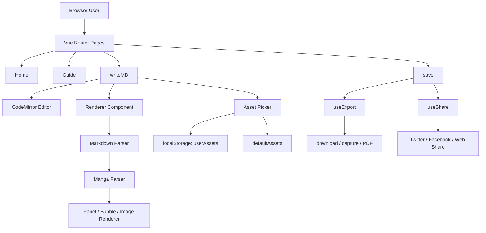

# MangaDown サービス整理

## 1. このサービスは何をするものか

MangaDown は、Markdown の記述をもとに漫画風のレイアウトを組み立て、プレビュー・保存・書き出しまで行えるブラウザ型アプリです。

主な目的は次の通りです。

- Markdown で漫画の構成を記述する
- パネル・吹き出し・画像・背景を組み合わせて漫画を描く
- リアルタイムプレビューで編集内容を確認する
- 画像素材の保存・管理・再利用を行う
- 生成した漫画を Markdown / HTML / PNG / PDF として出力する
- X や Facebook などで共有できるようにする

一言でいうと、

> Markdown ベースの漫画エディタ / 公開プレビュー / 書き出しツール

です。

---

## 2. どんな体験を提供しているか

アプリの流れは以下のような UX になっています。

1. ホーム画面で「漫画を作る」または「ガイドを見る」を選択
2. エディタ画面で Markdown を記述
3. `:::manga ... :::` の中に漫画の定義を入れる
4. プレビューで漫画としてレンダリングされる
5. 公開画面で Markdown / PNG / PDF を出力・共有

つまり、通常のテキスト編集と漫画描画の中間に位置する、
「文章を漫画に変換する作業支援型サービス」です。

---

## 3. 画面構成とユーザーフロー

### 3.1 画面一覧

| 画面 | 役割 |
| --- | --- |
| Home | ランディングページ、開始導線 |
| Guide | Markdown 記法とサンプル解説 |
| writeMD | 編集画面（Markdown + プレビュー） |
| save | 公開前確認・出力・共有 |
| parseUrl | URL 取り込みの入口（未実装に近い） |

### 3.2 期待される利用フロー

```text
Home
  -> 漫画を作る
      -> writeMD
          -> Markdown編集
          -> プレビュー確認
          -> save
              -> PNG/PDF/Markdown/HTML出力
              -> X/Facebook/ネイティブ共有
```

---

## 4. 技術構成

### 4.1 フロントエンド

- Vue 3
- Vite
- Vue Router
- Composition API

アプリ全体は SPA (Single Page Application) として動作し、
ルーティングで画面遷移を実現しています。

### 4.2 主要ライブラリ

- `codemirror`
  - Markdown エディタ部分
- `@codemirror/lang-markdown`
  - Markdown の構文支援
- `marked`
  - Markdown を HTML へ変換
- `html-to-image`
  - HTML/DOM を PNG に変換
- `jspdf`
  - PNG から PDF を生成
- `tailwindcss`
  - スタイル補助

### 4.3 実行方式

- フロントエンドのみの構成
- サーバーサイドは基本存在しない
- 保存や画像管理は `localStorage` に依存する

つまり、これは「バックエンドなしのクライアントサイドの漫画作成ツール」です。

---

## 5. システム構成の整理

### 5.1 全体アーキテクチャ



### 5.2 レイヤー構成

#### 1) UI レイヤー
- `src/views/`
- `src/components/`

画面と表示コンポーネントがここにあります。

例:
- `Home.vue`
- `writeMD.vue`
- `save.vue`
- `guide.vue`
- `components/renderer/Renderer.vue`
- `components/manga/Viewer.vue`

#### 2) ルーティング層
- `src/router/index.js`

Vue Router によってページ遷移を担当します。

#### 3) パーサー層
- `src/parser/markdown/parseMarkdown.js`
- `src/parser/manga/parseManga.js`
- `src/parser/manga/parsers/*.js`

ここが中核です。

- Markdown 全体を `:::manga ... :::` ブロックに分解する
- その中の panel / bubble / image / text をパースする
- UI 用の構造に変換する

#### 4) レンダリング層
- `src/components/manga/*`
- `src/components/renderer/*`

`parseManga()` の結果を Vue コンポーネントに落とし込み、
漫画のパネルと吹き出しを画面に描画します。

#### 5) データ管理層
- `src/utils/userAssets.js`
- `src/utils/userFolders.js`
- `src/data/defaultAssets.js`
- `src/data/defaultFolders.js`

- ユーザーがアップロードした画像
- 既定の素材セット
- フォルダ管理

を `localStorage` で保持しています。

#### 6) 書き出し・共有層
- `src/composables/useExport.js`
- `src/composables/useShare.js`
- `src/utils/capture.js`
- `src/utils/download.js`
- `src/utils/pdf.js`

ここで以下を実装しています。

- Markdown ダウンロード
- HTML ダウンロード
- PNG 出力
- PDF 出力
- X / Facebook / Web Share

---

## 6. コア機能の中身

### 6.1 Markdown ベースの漫画記法

アプリの特徴は、通常の Markdown そのものに漫画定義を埋め込む方式です。

```md
:::manga
# panel
- backgroundColor: #eeeeee
- position: { x:0, y:0 }
- size: { w:300, h:300 }

## bubble
- layer: 1
- shape: square
- position: { x:35, y:30 }
- size: { w:100, h:100 }

### text
- content: "こんにちは！"
- size: 20
:::
```

このような記法をパーサーが解釈して、UIの漫画としてレンダリングします。

### 6.2 パネル構造

漫画は `panel` を中心に構成されます。

- 背景色
- 位置
- サイズ
- 画像や吹き出しを含む

### 6.3 吹き出し構造

- `bubble`
- `text`
- `tail`

吹き出しの形状、位置、サイズ、テキスト内容が指定できます。

### 6.4 画像素材管理

ユーザーは画像をアップロードし、
`AssetPicker` から選択して漫画内に挿入できます。

- 永続化: `localStorage`
- 既定素材 + ユーザー素材の併用
- フォルダ分けやタグ管理が想定されている

---

## 7. データの流れ

### 7.1 編集 → プレビュー

```text
writeMD.vue
  -> CodeMirror にて Markdown 入力
  -> content ref に保存
  -> Renderer.vue
      -> parseMarkdown()
      -> parseManga()
      -> Panel / Bubble / Image を描画
```

### 7.2 公開 → 書き出し

```text
save.vue
  -> markdown ref を読み取り
  -> Renderer でプレビュー表示
  -> useExport
      -> capturePNG / downloadPDF / downloadText
  -> 出力
```

### 7.3 画像素材の保存

```text
UploadDialog
  -> FileReaderで画像を Base64 化
  -> saveUserAsset()
  -> localStorage に保存
  -> AssetPicker から再利用可能
```

---

## 8. 主要ファイルの役割

### UI
- `src/App.vue` : ルート表示
- `src/main.js` : アプリ起動
- `src/router/index.js` : ルーティング

### 画面
- `src/views/Home.vue` : ホーム
- `src/views/writeMD.vue` : エディタ
- `src/views/save.vue` : 出力/共有
- `src/views/guide.vue` : 使い方ガイド
- `src/views/parseUrl.vue` : URL取り込みの入口

### パーサー
- `src/parser/markdown/parseMarkdown.js` : Markdown ブロック分割
- `src/parser/manga/parseManga.js` : 漫画データ抽出
- `src/parser/manga/parsers/*.js` : 要素別パース

### レンダリング
- `src/components/renderer/Renderer.vue`
- `src/components/manga/Viewer.vue`
- `src/components/manga/Panel.vue`
- `src/components/manga/Bubble.vue`

### 資材管理
- `src/utils/assetResolver.js`
- `src/utils/userAssets.js`
- `src/components/library/AssetPicker.vue`

### 書き出し/共有
- `src/composables/useExport.js`
- `src/composables/useShare.js`
- `src/utils/capture.js`
- `src/utils/download.js`
- `src/utils/pdf.js`

---

## 9. 実装上の特徴

### 長所

- フロントエンドだけで完結している
- Markdown ベースで簡単に編集できる
- 漫画をプレビューしながら作れる
- PNG/PDF/HTML/Markdown の多様な出力に対応
- 画像素材をローカルで管理できる

### 制約・懸念

- バックエンドがないため、共有やデータ永続化がクライアント依存になりやすい
- `localStorage` ベースなので、複数端末間同期はできない
- `parseUrl.vue` は入口だけあり、実際の URL 解析機能は未実装に近い
- 漫画の表現は Markdown 記法に依存するため、自由度と記法の複雑さが両立しにくい

---

## 10. 結論

MangaDown は、

「Markdown を使って漫画を作り、プレビューし、書き出し・共有まで一貫して行える、ブラウザ型の漫画制作支援サービス」

と整理できます。

特に、

- Markdown という簡易な入力形式
- パーサーが漫画構造に変換する設計
- Vue のコンポーネントで漫画をレンダリングする構成
- 出力と共有機能

が主な価値です。

この構成を見る限り、サービスの中核は「Markdown を漫画仕様へ変換するパーサー + レンダラ + 出力機能」の組み合わせであり、
本格的な SaaS ではなく、ローカルで完結するクリエイティブツールとして設計されています。
